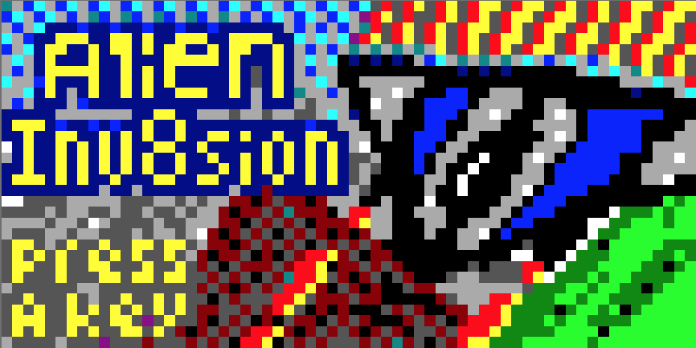

# Alien Inv8sion

A fun project for [Octojam 8](https://itch.io/jam/octojam-8). Challenge: write a
game for the illustrious Chip-8 platform in the month of October.

To play:

  * [The game on Itch.io](https://timendus.itch.io/alien-inv8sion)
  * [Just the game, running in your browser!](https://timendus.github.io/alien-inv8sion/silicon8)

Bonus content:

  * [Suggested soundtrack](https://www.youtube.com/watch?v=Pz1a9MM-Vn4&ab_channel=ThePrimeThanatos) 🎶😄
  * [Run the game in the Octo interpreter](https://timendus.github.io/alien-inv8sion/octo), to prove it's still just a regular XO-CHIP game 😉 (reduced colours)

## How to play Alien Inv8sion

### Controls

  * Arrow keys or WASD to control your ship (or keys 5, 7, 8 and 9 on mobile / Cosmac VIP)
  * E or spacebar to fire lasers (or key 6 on mobile / Cosmac VIP)

### Gameplay

You are famed airship pilot Gunnar Gunman, and after the aliens striked first
and destroyed most of the human fleet, you are planet Earth's only hope! Destroy
as many aliens as you can before they hit the ground to give your fellow human
being a fighting chance! 👽

For each alien spaceship you shoot down, you gain points (shown on the top left,
indicated with "PTS"). If you let alien ships escape and get down to the planet,
you lose points. For every 250 points you collect, you go up a level (current
level shown bottom left, indicated with "LVL"). But beware! Each level, the
attacks get more fierce!

Your ship does not have unlimited power. The power meter (white indicator on the
left of the playfield, which turns red) shows you how much power your ship has
left. Shooting your lasers takes power, and if you lose power your lasers will
be less powerful. More importantly, your power also feeds your shields. If you
run your ship into alien ships, your shield will compensate and draw power. Lose
all your power and you lose your shields, leaving you vulnerable to the alien
ships!

Good luck Gunnar, and may lady luck smile on you!

## The concept

Alien inv8sion is a nod to the endless stream of space shooters that popped up
in the late 70s and early 80s after the popularity of the game Space Invaders
from 1978. This is very much the exact same period in which CHIP-8 became
popular, and there are a lot of Space Invaders clones and other space shooters
for CHIP-8. Time to add my twist on the theme to the fray!

Having recently developed a WebAssembly CHIP-8, SCHIP and XO-CHIP interpreter
called [Silicon8](https://github.com/Timendus/silicon8) that supports the full
range of XO-CHIPs potential colour space [[1]](#notes) (a whole whopping 16
colours!) I figured it would be a shame not to make use of those colours in my
next game. So I did, and I bumped the virtual CPU speed to an absolutely insane
12Mhz to bring CHIP-8 (or more specifically XO-CHIP) much closer to the coveted
arcade systems of the time, or even systems like the NES.

Unfortunately I didn't have very much time to work on this game this year, and
the actual gameplay may not be what you expect from an arcade or NES game. But
it's fun to fly around and shoot aliens, and as a demo of what CHIP-8 can do if
pushed: a fully animated colourful parallax background with lots of masked
sprites flying across the screen!

A big thanks to **[@mirandavdende](https://github.com/mirandavdende)** for
helping with playtesting the game!

If you like this, you may also like my submission from last year, [3D Viper
Maze](https://github.com/Timendus/3d-viper-maze).

### Notes

[1] See the [XO-CHIP
specification](https://github.com/JohnEarnest/Octo/blob/gh-pages/docs/XO-ChipSpecification.md#bitplanes),
specifically the last lines about bitplanes. I think Silicon8 is probably the
first interpreter to actually implement this "hidden feature"?

## Development notes

### Day one: Ambitious beginnings

Taking inspiration from the good old days, I thought it would be cool to do
something with [parallax
scrolling](https://en.wikipedia.org/wiki/Parallax_scrolling) this year, to
create the illusion of depth. Also, having kind-of finished my interpreter slash
emulator [Silicon8](https://github.com/Timendus/silicon8), I thought it would be
really neat to make something that could show off its 16 colour abilities.

My first idea was to make a cartoony side scrolling platform game, maybe
something with a spider wanting to get inside where its warm. Drawing
inspiration from the fact that this is the eighth installment of Octojam, I
thought something with an eight legged protagonist made sense 🕷

With these ideas in mind I started work on a couple of rendering routines that
operate on a display buffer in memory. Having multiple things on top of each
other (parallax layers, platforms, player and enemy sprites) required me to be
able to mask out parts of the existing image. The XOR sprite routine of CHIP-8
is not up to such a task. And I need to be able to operate on four separate
planes to use all 16 colours.

https://user-images.githubusercontent.com/2649939/139667898-555d67ce-d519-4963-98e6-2e06f9a36bdf.mp4

_First tests with the buffered rendering code_

But it quickly became obvious that I basically had no time available for a
project of this size. Last year I had quite a bit of time on my hands because
everything fun in the world was cancelled due to the Corona virus. But this year
we had plans to go hiking for a week, and my date just moved in. So lots to do
and too little time to do it in, and day two just didn't come for three weeks.

### Day two: Running out of time already?!

With just five days left to participate in the jam, I needed to switch gears
pretty fast. A platform game with multiple levels and a storyline was clearly
out of the question. But the basic rendering stuff was there to do something
with overlapping sprites and I still really wanted to show off my 16 colours and
build something that had parallax scrolling. It just needed to be more simple
and less design intensive.

So I made a quick sketch and got to work on a quick and dirty side scrolling
space shooter. First, I finished the masking stuff and added more planes to be
able to use colour. A couple of ugly sprites and some maths later and I had
something that resembled a parallax scrolling background. Not being able to
render sprites partly off screen on the left side was an issue I didn't feel
like solving, so I hid the crime behind a status bar 😉 The spidery player sprite
changed into a spaceship that could shoot lasers, and we were off to the races.

https://user-images.githubusercontent.com/2649939/139667984-42d81ad4-fc3d-4f16-9dba-7c2981cc97fe.mp4

_The above test with added colours, masking and an animated background_

### Day three: Give me something to shoot!

Shooting lasers is no fun without anything to shoot, so on day three I added the
enemy spaceships. An endless stream of enemy ships had to come in from the
right, with the player having to keep them at bay. A "fast paced version of
space invaders" seemed like a good place to start.

To accomplish this, I created a table in memory, 30 rows long, that holds the
properties of all the alien ships. Every so often the game triggers half of
those rows to become one of two types of enemy ships. When the ship gets shot,
its type changes to "explosion" (which is crudely animated) and then gets
another 50% chance to restart. The same goes for ships that reach the other side
of the screen, but without the explosions. All in all, this gives the player
a lot to shoot at, and it feels pretty dynamic, like waves of enemies attacking.

Of course shooting alien spaceships is very little fun without a counter keeping
track of how many baddies you have shot. So I added a score counter that counts
up to 255. When it overflows you go up a level, and the ships get faster. When
alien ships reach the left side of the screen, you lose ten points. So at some
point it gets pretty difficult to get to the next level.

https://user-images.githubusercontent.com/2649939/139668063-769bd992-09de-4f4b-b557-b5a948cecffb.mp4

_Me showing off my mad alien shooting skillz_

I'm not sure where to go next. It's not really fun to get stuck on some level.
But it can be a competition with friends to see who gets the furthest, I guess.
Also, I feel like there should be some danger involved, like the enemies
shooting back or colliding in to you. I think I have to sleep on this 😄

### Day four: Pixel art

Still not entirely sure how I was going to fix the gameplay, I spent an evening
doing pixel art. The parallax background was really crude the first time around,
so I gave it a do-over. Same with the explosion animation and the alien UFO
ship. Looking a bit less bad this time 😜

https://user-images.githubusercontent.com/2649939/139668118-aa720364-95d8-45a6-ab8a-956e24bd93bd.mp4

_I'm quite pleased with how the background turned out_

### Day five: Wrapping things up

Only 1 day and 18 hours left on the clock!

There are always a couple of things that need doing before you can release your
project. Generally speaking that's more work than you expect it to be. In this
case I had to build a version of Silicon8 that would just start the game at the
right speed and nothing else. Also I needed to choose a name, rename the Github
repository and fix Github pages to host the game. Plus lots of small things.

It's a bit counter intuitive to do these things first, and then get back to the
core game mechanic, but this way I can be much more relaxed, knowing that when
the deadline comes I can just hit compile, `git push` and submit!

Then I got back to working on the gameplay. First, I decided that the game
needed to be a bit more communicative and not just plain drop you in the action.
A game needs to be more than just the core game loop. It needs stages and
progress. So I added a title screen, showing off all the pretty little colours,
and a "Level X, GET READY!" overlay to notify you when you actually gain a
level. These things make the whole thing feel much more like an actual game that
you can move through.

Next I fixed a couple of lingering bugs, the biggest of which being the hit
detection on the laser. It's no fun if you shoot an alien and they just don't
die 🙈

### Day six: It's not a real game if you can't die

I decided that the game needed another gameplay mechanic to be more dynamic. The
game was way too easy to beat (just continuously keep shooting and move up and
down) and as a result a bit boring to play, until you hit the higher levels. And
then it was just impossible to win. That's no fun.

So I came up with the idea to add a power bar that depletes when you use your
laser or get hit by an alien ship, and recharges over time. I just started
implementing this idea and adding little details along the way, like your shield
that's glowing bright if you have enough energy, starts to dim if you run out of
energy and disappears when your energy is depleted. Also, I figured, if your
shield is down and you get hit by an alien ship, that should be game over.

Obviously, I then needed to add an explosion of the player's ship, followed by a
"Game over" screen. All this stuff made the code even more spaghetti than it
already was, but as long as it works and it's stable I'm fine with that for a
game jam 😄

Finally it was a matter of tweaking the difficulty of the game to make it fun to
play for newcomers. Getting 20 ships in your face in level one turned out to be
a bit too much for my playtester 🛸 😌

So, with 11 hours left on the clock, it's time to submit this game to Octojam 8!
Thanks for reading and good luck with your own projects!
